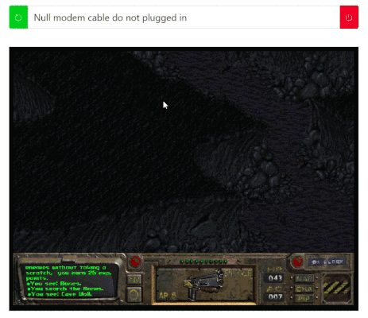
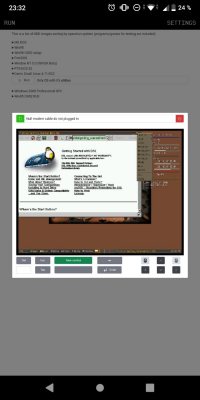
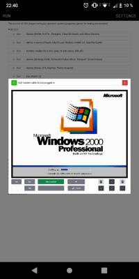
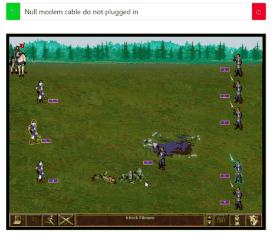

<div align="center">
<h1 style="text-align:center"> 486.sx  online emulator user interface</h1>


</div>

**486.sx** is tiny (< _55 KB_ compressed size) emulator of a popular computer system from the early 90s. It is written entirely in TypeScript. It's interesting to try to achieve acceptable performance without using WASM. This simple UI demonstrates the emulator's capabilities with some performance loss compared to the original. But it is still quite functional (it can even be installed locally as a PWA).

**486.sx** is not a fork of any other project, so as expected it may contain bugs. Don't expect the impossible - such monsters of their time as _Quake II_ or _HOMM III_ currently launch extremely slowly, but you can still try them. On the other hand, _Windows 2000_ runs quite well. It is also possible to connect two emulators over a network via a virtual null modem cable. And play _DOOM I/II_, _Warcraft I/II_, _HOMM II_ or _Transport Tycoon Deluxe_ with a friend online. Or maybe you want to remember what it was like when _Fallout_ or _GTA_ was only in one part? In any case - [welcome to DEMO!](http://jsconst.github.io/486sxUI "welcome!")

<div align="center"></div>

<div align="center">
<h2>Characteristics of the emulated system</h2>


</div>

The processor frequency varies depending on the current version of the emulator (I'm going to implement a floating frequency). Currently the processor frequency is set to 66 MHz. Do not forget that the contents of the hard drive are loaded dynamically and then cached. Therefore, we can consider the emulator's HDD as a gradually accelerating device. While the hard drive is not cached, it slows down the system. There is currently no sound card, only a PC speaker is present. In further plans, there is a sound card (most likely GUS).

<div align="center"><h2>Emulator's API</h2></div>

The emulator is imported as an object; you can install it on a website and organize your own version of the user interface. Now it works in demo mode. Perhaps in the future, based on it, you can organize a kind of captcha. Or something else useful. You can read match more about how to use the API [here.](https://jsconst.github.io/486sxUI/#/api "here.") This is a small example:
```javascript
import { api } from "https://486.sx/script/index.js";

// hard disk image number
const img = "1";
// null modem parameters (null - w/o null modem cable)
const nmp = null;
// virtual screen for emulator
const scr = document.querySelector("canvas");
// list of required URLs
const url = {
    // URL for BIOS image downloader
    getRomURL : "https://486.sx/",
    // URL for WebWorker that loads HDD data
    workerURL : "https://486.sx/script/hddLoader.js",
     // URL for HDD image downloader
    getImgURL : "https://486.sx/https://486.sx/",
    // URL for AudioWorklet that plays audio
    workletURL : "https://486.sx/worklet/soundProcessor.js"
}
// got the emulator object
const emu = api(img, npm, scr, url);
// add basic keyboard and mouse handlers to the emulator
for (let key in emu.ctrls.screenCtrls) {
    scr.addEventListener(key, emu.ctrls.screenCtrls[key]);
}
// start the emulator
emu.run();
// start displaying on the virtual screen
emu.show();
// define a stop button for the emulator
document.getElementById("btnStop").addEventListener("click", emu.stop);
```

<div align="center"><h2>UI, Backend and PWA</h2></div>

A primitive user interface has been written for the emulator. Svelte was chosen as the framework - a fairly fast library compared to the others (performance matters). The Svelte-Chota library of ready-made components was also used. There is also a NodeJS backend for zero modem connections (a few-line program for connecting two websockets using a single ID). At the moment, the UI is not a user-friendly tool, and the backend is 100% reliable. They simply demonstrate the capabilities of the emulator engine. The user interface can be installed as a progressive web application, but currently cannot be used completely offline.

<div align="center">


<h2>Plans for the near future</h2>
</div>


<li>
<ul>Transfer the emulator logic to a separate thread (worker) so that the UI does not affect performance</ul>
<ul>Add a second larger hard drive</ul>
<ul>Work on the performance of the emulator</ul>
<ul>Make emulation of the sound subsystem (to begin with, implement Gravis Ultrasound)</ul>
<ul>Implement a modem connection so that you can organize a FIDO-type network</ul>
<ul>Make the user interface really convenient</ul>
</li>

<div align="center"></div>